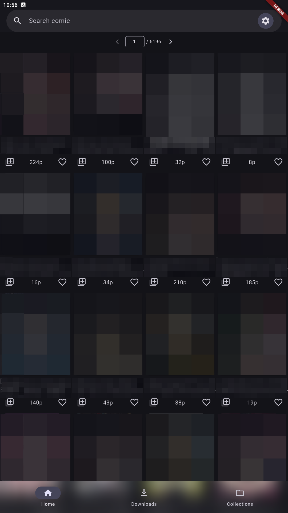
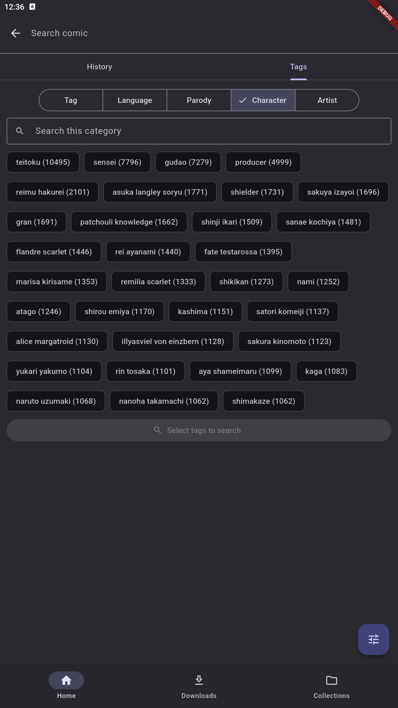
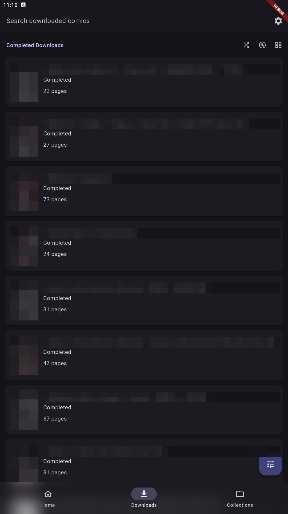
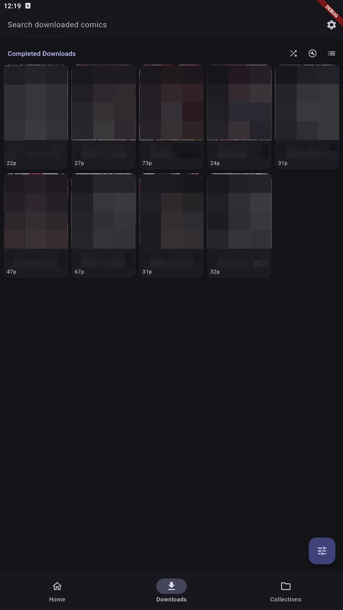
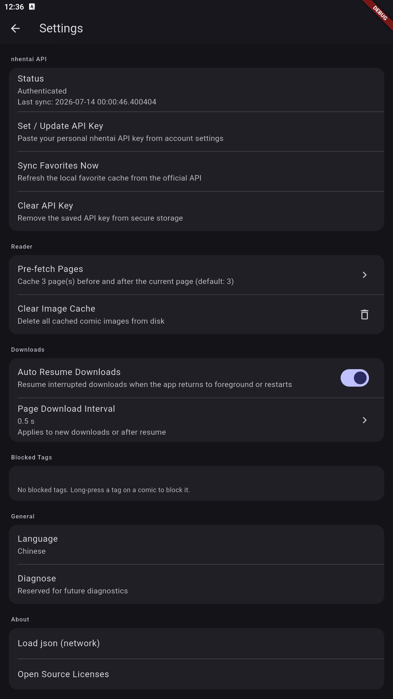

[![MIT License][license-shield]][license-url]

 

  <h3 align="center">nhviewer-universal</h3>

  

    A Flutter rewrite of NHViewer.  
    Built with Material 3 / glassmorphism UI, cross-platform support, Drift-based local
    persistence, an offline tag catalog with instant search, and an incremental download
    management flow.
     
     
    <a href="https://github.com/BadIdeaLab/comicdex/issues">Report Bug</a>
    ·
    <a href="https://github.com/BadIdeaLab/comicdex/issues">Request Feature</a>
  

<table align="center">
  <tr>
    <td align="center"> Home feed & search</td>
    <td align="center"> Tag catalog — instant search</td>
  </tr>
  <tr>
    <td align="center"> Downloads — list view</td>
    <td align="center"> Downloads — grid view</td>
  </tr>
</table>

---

## Features

- Home feed with search and language-aware fallback queries
- Local, offline tag catalog with instant cross-category search and multi-select
  (tag / language / parody / character / artist), ranked by popularity
- Blocked tag list — exclude specific tags from all search results
- Collections flow for `Favorite / Next / History`
- Downloads tab for queued, paused, failed, and completed download jobs
- Favorites multi-select download with select-all, already-downloaded skipping, and
  request throttling to avoid rate limits
- Resumable page-by-page downloads with offline asset persistence
- Repair and reload for completed downloads (re-fetch missing pages or full re-download)
- Offline reader entry for completed downloads using local page files
- Download list search across titles and tags, sortable by title/author/popularity/last read
- Reader end-of-comic overlay, page-jump navigation, and navigation expansion on last page
- Vertical reader experience
- Glassmorphism-styled UI across reader, screens, and sheets with cross-platform
  performance tuning
- Android build pipeline and GitHub-hosted unsigned iOS build verification

<a href="#readme-top">‣ back to top</a>

## Login

Browsing and reading don't require an account. You only need to log in if you want to sync
your nhentai favorites into the Collections tab.

1. Log into your account on [nhentai.net](https://nhentai.net)
2. Open your account settings on the site and copy your personal API key
3. In the app, go to **Settings → Set / Update API Key** and paste it in
4. Tap **Sync Favorites Now** to pull your favorites in

  

<a href="#readme-top">‣ back to top</a>

## Tech Stack

Flutter · Provider · Go Router · Drift + sqlite3 · Dio · Freezed / json_serializable

<a href="#readme-top">‣ back to top</a>

## License

Distributed under the MIT License. See `LICENSE.txt` for more information.

<a href="#readme-top">‣ back to top</a>

## Contact

This repository (`comicdex`) is an independently maintained, unofficial mirror. It is not
run by, and has no other affiliation with, the original author below.

Original Author: ttdyce - i@ttdyce.com

Upstream Project: [https://github.com/ttdyce/nhviewer-universal](https://github.com/ttdyce/nhviewer-universal)

<a href="#readme-top">‣ back to top</a>

## Acknowledgments

- [ttdyce/nhviewer](https://github.com/ttdyce/NHentai-NHViewer)
- [nhentai.net](https://nhentai.net)
- [NHBooks](https://github.com/NHMoeDev/NHentai-android)
- [EhViewer (deprecated)](https://github.com/seven332/EhViewer)
- [rrousselGit/provider](https://github.com/rrousselGit/provider)
- [cfug/dio](https://github.com/cfug/dio)
- [simolus3/drift](https://github.com/simolus3/drift)
- [Baseflow/flutter_cached_network_image](https://github.com/Baseflow/flutter_cached_network_image)
- [fluttercommunity/flutter_launcher_icons](https://github.com/fluttercommunity/flutter_launcher_icons/)
- Flutter

<a href="#readme-top">‣ back to top</a>

[license-shield]: https://img.shields.io/github/license/BadIdeaLab/comicdex.svg?style=for-the-badge
[license-url]: https://github.com/BadIdeaLab/comicdex/blob/main/LICENSE.txt
