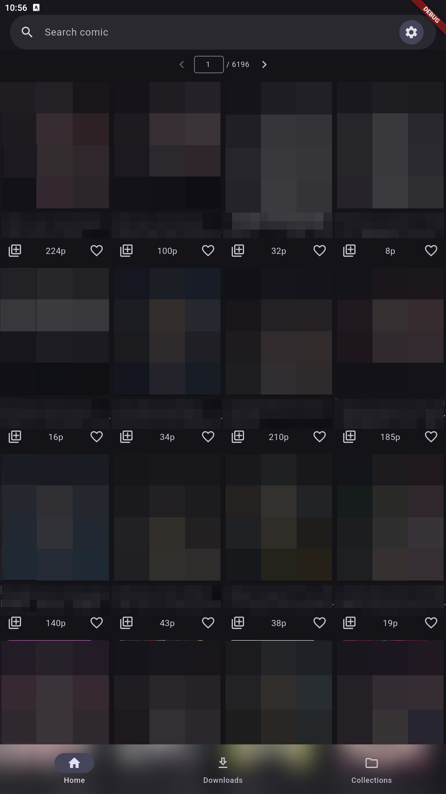
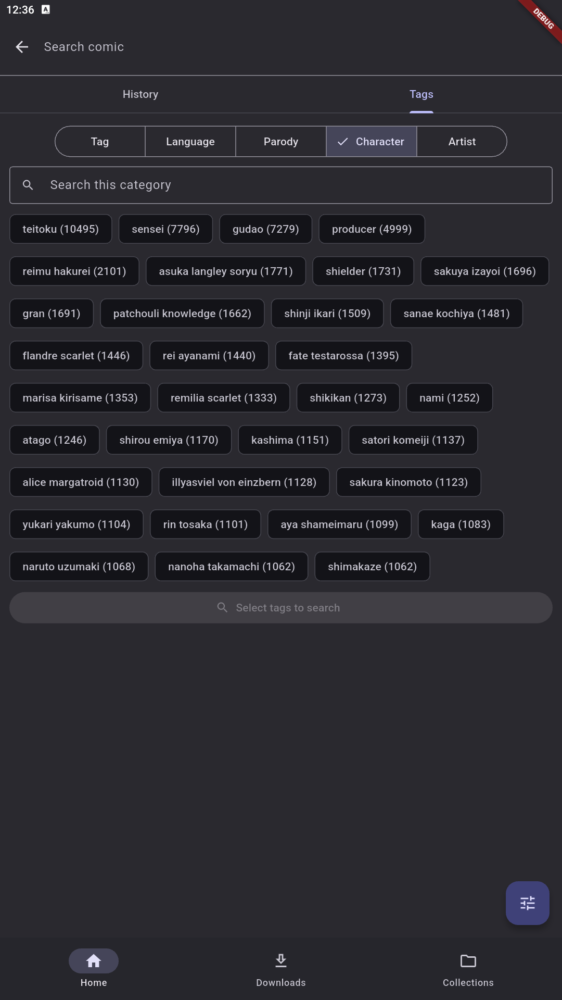
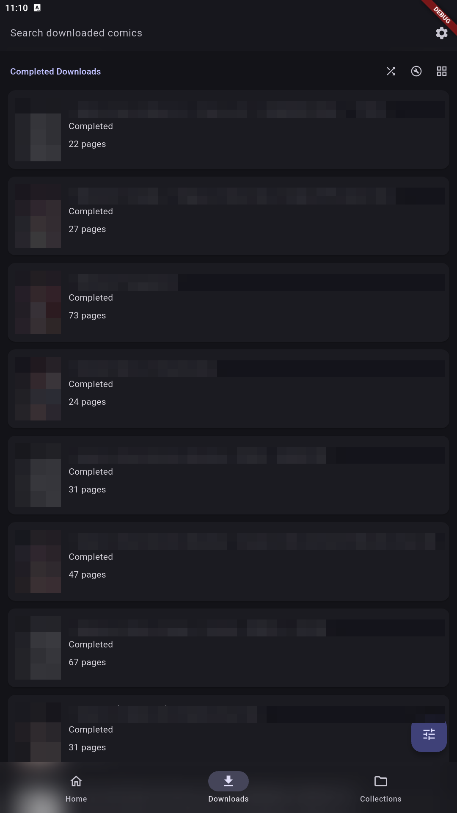
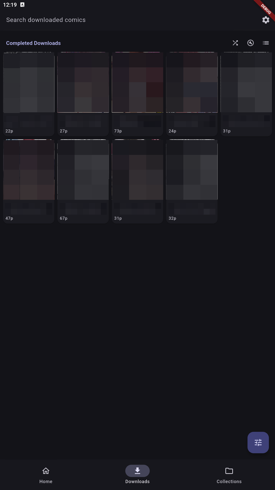
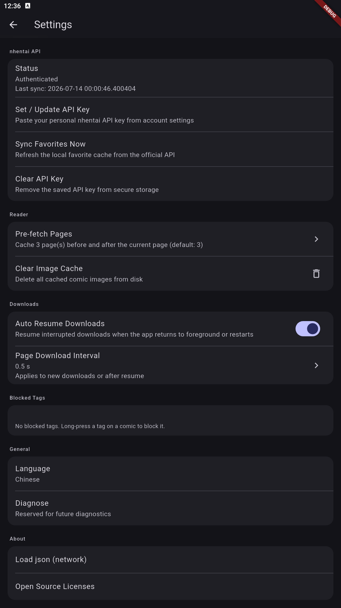

[![MIT License][license-shield]][license-url]

 

  <h3 align="center">nhviewer-universal</h3>

  

    A Flutter rewrite of NHViewer.  
    An offline-first reader: an on-device tag catalog with instant search, resumable
    downloads you can read without a connection, recommendations and taste analysis
    built from what you actually keep, and LAN backup of the whole library to your
    own machine.
     
     
    <a href="https://github.com/BadIdeaLab/comicdex/issues">Report Bug</a>
    ·
    <a href="https://github.com/BadIdeaLab/comicdex/issues">Request Feature</a>
  

<table align="center">
  <tr>
    <td align="center"> Home feed & search</td>
    <td align="center"> Tag catalog — instant search</td>
  </tr>
  <tr>
    <td align="center"> Downloads — list view</td>
    <td align="center"> Downloads — grid view</td>
  </tr>
</table>

---

## Features

### Search and browsing

- Offline tag catalog: instant cross-category search and multi-select across
  tag / language / parody / character / artist, with no network round trip
- A blocked tag list that applies to every search, not just the one in front of you
- Language shown on each cover, read from the listing's own tag ids — no extra requests

### Downloads and offline reading

- Resumable page-by-page downloads, readable with no connection
- Repair: scan one comic or the whole library for missing pages and covers
- Multi-select download from Favourites, skipping what you already have and throttling
  requests so the site is not hammered
- Sort by date / title / author / popularity / last read / taste, and search by tag
  including its translated name
- "Open something random", weighted towards what you have not read in a while — without
  ever excluding anything outright

### Recommendations and taste

- After the last page: comics from your own library that genuinely resemble the one you
  just finished, and an optional look on the site for more, excluding what you have
- Badges on comics matching the tags you keep — scored against your own library rather
  than against what is merely popular
- Analysis page: tag coverage, the full ranking, and which tags you tend to collect
  together
- Track artists and be told when they publish. Checks are foreground-only and
  rate-limited to fewer than two requests an hour however many artists you follow

### Backup and restore

- Mirror the whole download library and database to a desktop server over your LAN
- Pair by QR code or PIN; transfers are incremental and can be paused and resumed
- An interrupted restore is detected on the next launch rather than left looking normal

### Platform

- Android and iOS, with a Windows desktop server for backups
- English and Traditional Chinese interface

<a href="#readme-top">‣ back to top</a>

## Login

Browsing and reading don't require an account. You only need to log in if you want to sync
your nhentai favorites into the Collections tab.

1. Log into your account on [nhentai.net](https://nhentai.net)
2. Open your account settings on the site and copy your personal API key
3. In the app, go to **Settings → Set / Update API Key** and paste it in
4. Tap **Sync Favorites Now** to pull your favorites in

  

<a href="#readme-top">‣ back to top</a>

## Tech Stack

Flutter · Provider · Go Router · Drift + sqlite3 · Dio · Freezed / json_serializable

<a href="#readme-top">‣ back to top</a>

## License

Distributed under the MIT License. See `LICENSE.txt` for more information.

<a href="#readme-top">‣ back to top</a>

## Contact

This repository (`comicdex`) is an independently maintained, unofficial mirror. It is not
run by, and has no other affiliation with, the original author below.

Original Author: ttdyce - i@ttdyce.com

Upstream Project: [https://github.com/ttdyce/nhviewer-universal](https://github.com/ttdyce/nhviewer-universal)

<a href="#readme-top">‣ back to top</a>

## Acknowledgments

- [ttdyce/nhviewer](https://github.com/ttdyce/NHentai-NHViewer)
- [nhentai.net](https://nhentai.net)
- [NHBooks](https://github.com/NHMoeDev/NHentai-android)
- [EhViewer (deprecated)](https://github.com/seven332/EhViewer)
- [rrousselGit/provider](https://github.com/rrousselGit/provider)
- [cfug/dio](https://github.com/cfug/dio)
- [simolus3/drift](https://github.com/simolus3/drift)
- [Baseflow/flutter_cached_network_image](https://github.com/Baseflow/flutter_cached_network_image)
- [fluttercommunity/flutter_launcher_icons](https://github.com/fluttercommunity/flutter_launcher_icons/)
- Flutter

<a href="#readme-top">‣ back to top</a>

[license-shield]: https://img.shields.io/github/license/BadIdeaLab/comicdex.svg?style=for-the-badge
[license-url]: https://github.com/BadIdeaLab/comicdex/blob/main/LICENSE.txt
